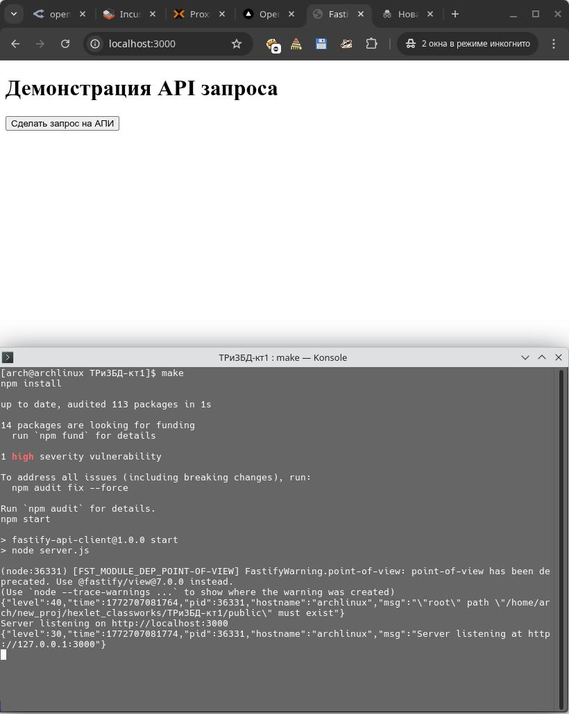
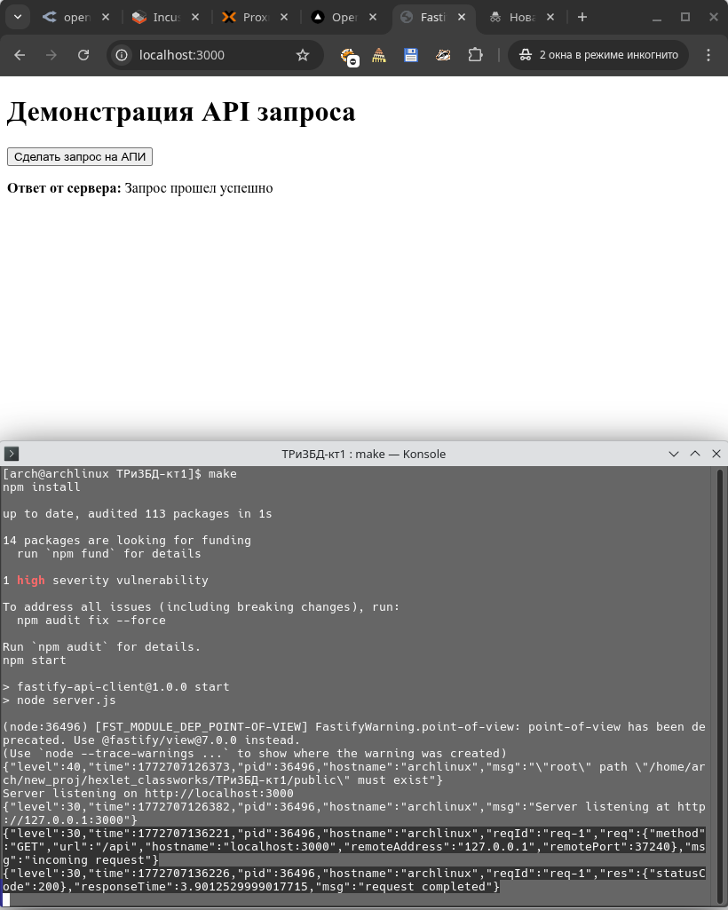

# Для запуска проекта понадобится:

## Вариант 1
 перейти в директорию проекта и прописать команду
```bash
make
```

## Вариант 2
 Установить зависимости
```bash
make install
```

 Запустить сервер
```bash
make run
```
---

## Для проверки задания понадобится

 Открыть [http://localhost:3000](http://localhost:3000/) в браузере




## после нажатия кнопки страница отправляет GET запрос на эндпоинт /api и обновляет содержание элементов на странице


